# EnhancedRAG

Metadata-enhanced retrieval-augmented generation over a formatting-rich
personal knowledge archive.

The archive carries author-applied formatting — highlight colour, bold,
tree position — that already encodes how important the author judged each
line. This project turns that formatting into retrieval metadata and
measures whether it helps, against a baseline that cannot see it. Nothing
in the retrieval code is specific to the archive's subject matter.

**Research question:** *How can we use RAG and LLMs on unstructured text
data with semantic metadata to optimize the quality and search
experience?*

This project was built for a Research and Innovation project and Bachelor's
thesis in Creative Technologies & AI at Howest (Kortrijk). Repository:
https://github.com/De-Vos-Arne/EnhancedRAG

> **This repository ships only a small, redacted subset of the original
> archive** (see `docs/REPLICATION.md`) — the full archive is private.
> Results reproduced against the shared subset will not match the numbers
> in the evaluation report below; the report was produced against the full,
> private archive. Rebuilding the index from scratch (`build_corpus.py` +
> `build_index.py`) takes roughly a day end-to-end even on capable local
> hardware — see `docs/REPLICATION.md` for the actual timings observed.
> What *is* shared in full: every line of code, the whole pipeline, the
> evaluation methodology, the raw statistical results, and the qualitative
> findings — only the underlying personal archive itself is withheld.

The full blind-rated evaluation (9 regimes × 27 questions, statistical
tables, per-group breakdown, qualitative findings) is in this repository:
[**`docs/report/evaluation_report.html`**](docs/report/evaluation_report.html)
— download or clone and open it directly in a browser, no server needed.

<p>
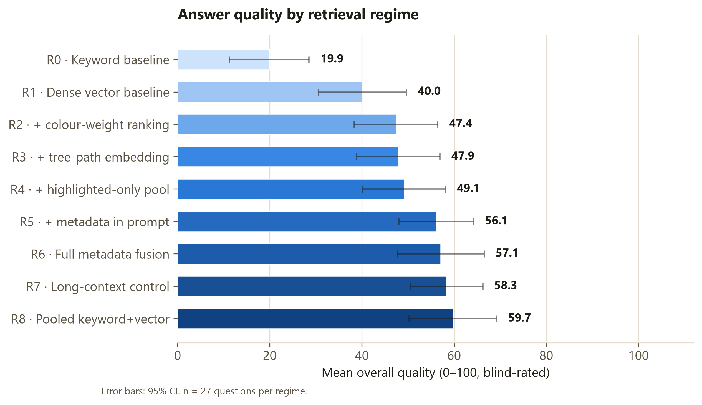
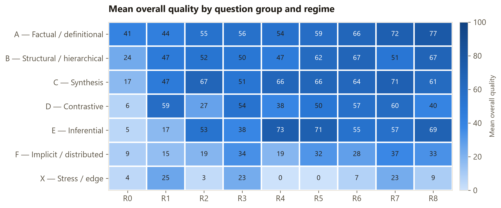
</p>
<p>
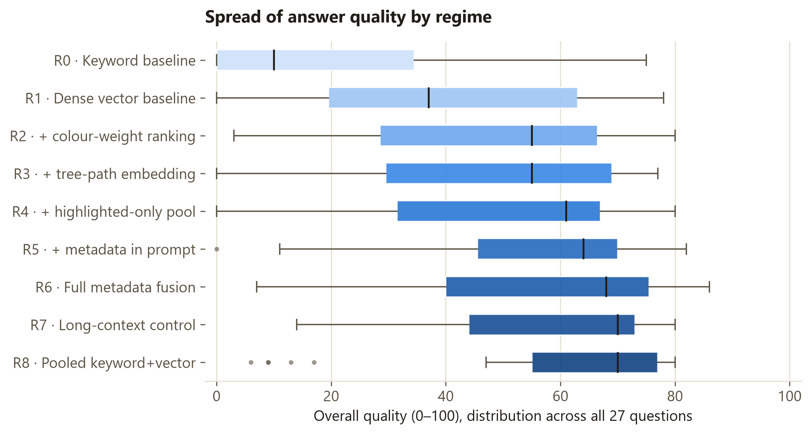
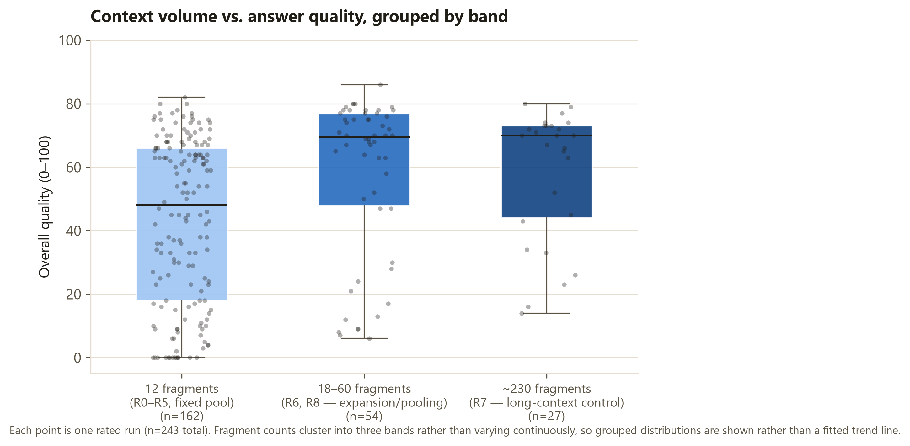
</p>

All five figures (300dpi PNG + SVG) are in
[`results/figures/`](results/figures/), including `fig4_every_question_heatmap`
(every question individually — too tall to inline here).

## Documentation

| Doc | Covers |
|---|---|
| [`docs/INSTALL.md`](docs/INSTALL.md) | Prerequisites, model backends, adding your own model, first run |
| [`docs/USER_GUIDE.md`](docs/USER_GUIDE.md) | Every tool — exact commands and URLs, features, what each is for |
| [`docs/ARCHITECTURE.md`](docs/ARCHITECTURE.md) | Repo layering, data flow, chunking, the colour system, the regime matrix, RightNote's file format reverse-engineered, the databases this project creates |
| [`docs/ANALYSIS.md`](docs/ANALYSIS.md) | Evaluation methodology, statistics, the figure generator, how to read the report |
| [`docs/REPLICATION.md`](docs/REPLICATION.md) | Dataset stats, effort/timing to reproduce, hardware used, model history, the redacted-subset archive |

## What's in this project

1. **[Archive Explorer](docs/USER_GUIDE.md#1-archive-explorer)** — a
   browser-based editor for the `.rnt` archive itself, built directly
   against the file format (no RightNote installation required to run it).
   Used for browsing, editing, and safely writing back to the archive
   during development.

   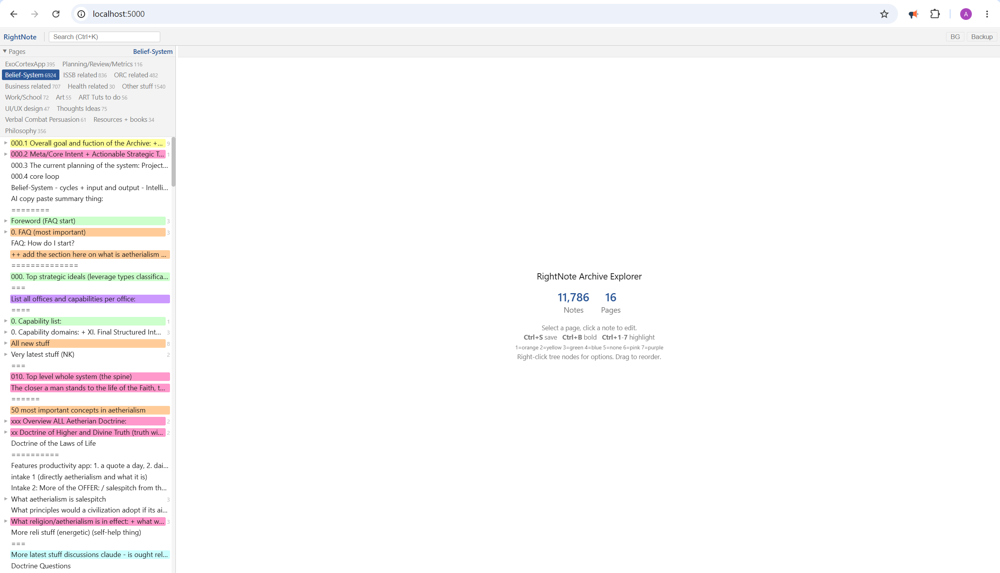

   1. **Debug view** — the same explorer with the RTF parser's chunk
      boundaries overlaid, for checking how a note actually gets split
      before trusting it downstream.

      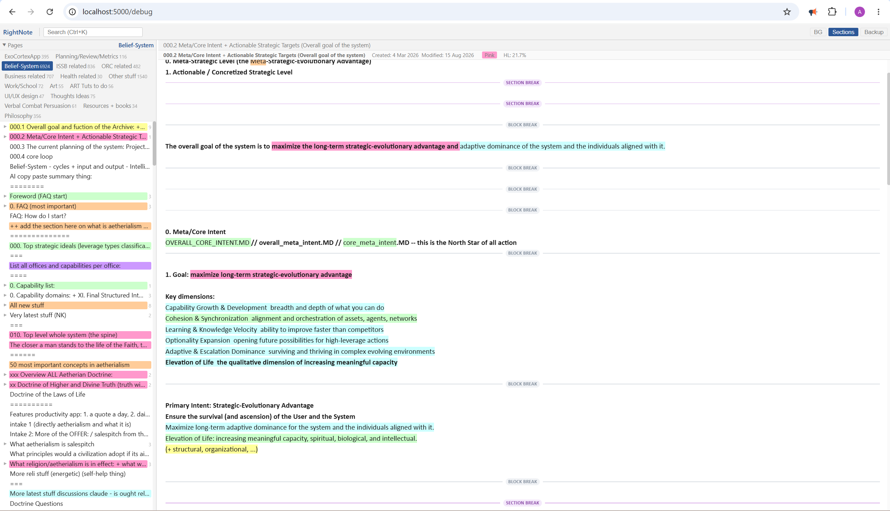
2. **[Retrieval bench](docs/USER_GUIDE.md#2-retrieval-bench)** — ask a
   question, compare any number of the nine retrieval regimes side by
   side, inspect the exact prompt sent to the model.

   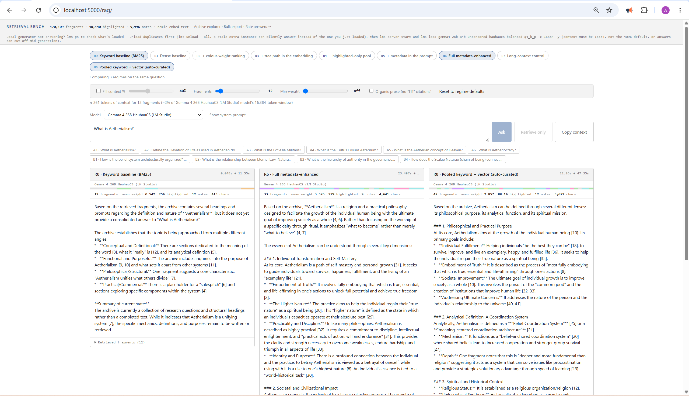
3. **[Bulk Export / curation tool](docs/USER_GUIDE.md#3-bulk-export)** —
   the practical, everyday-use side of this project: pull a large,
   thematically coherent slice of the archive — by colour, by branch, or
   by question — for pasting into an external chat (Claude, ChatGPT,
   Gemini) instead of running everything locally. Includes a
   question-driven curation mode and an AI-written "essence" summary mode.

   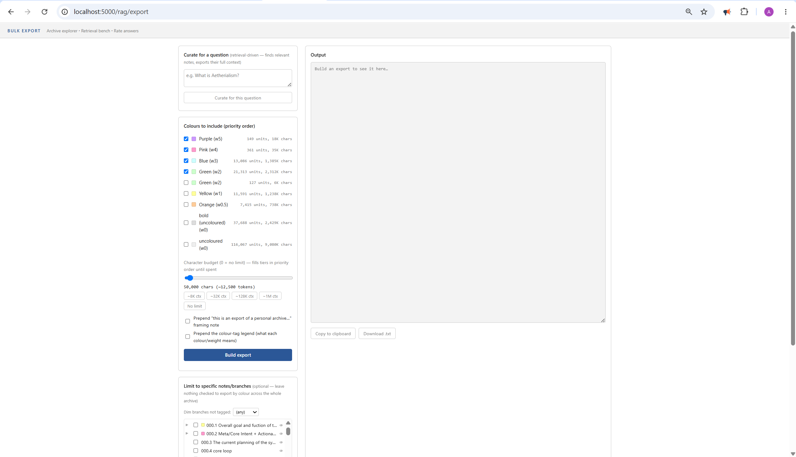
4. **[Clipboard tool](docs/USER_GUIDE.md#4-clipboard-tool)** — a
   Windows tray app for a tighter copy/paste loop directly out of
   RightNote (also works with Microsoft Word).

   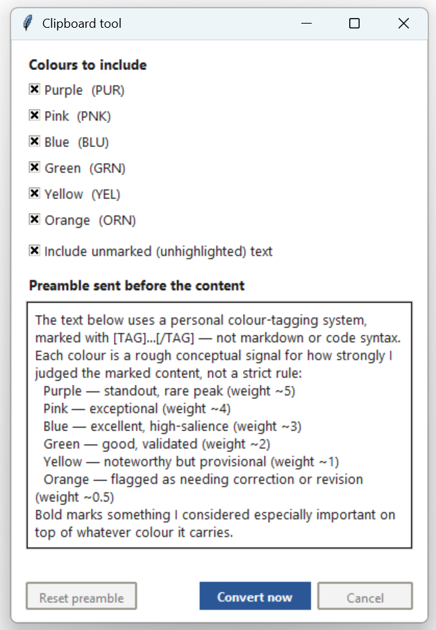
5. **[Rating UI](docs/USER_GUIDE.md#5-rating-ui)** — blind (or open) side
   -by-side comparison of every regime's answer to a question, the tool
   the thesis evaluation was actually scored through.

   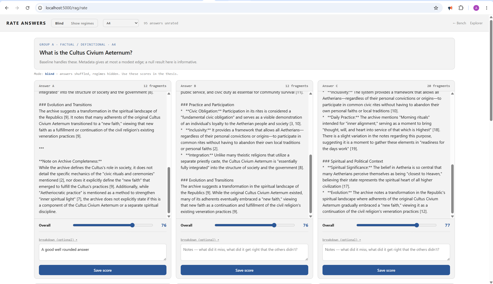
6. **[MCP server](docs/USER_GUIDE.md#6-mcp-server)** — exposes the archive
   read-only over the Model Context Protocol, so a connected model (e.g.
   Claude Desktop) can query it live instead of receiving a bulk export.
7. **[Analysis](docs/ANALYSIS.md#7-analysis)** — `analysis/build_dashboard.py` (interactive treemap +
   chunk-size dashboard used to design the chunking method),
   `analysis/generate_thesis_figures.py` (print-ready evaluation figures),
   and the statistics pipeline behind the published evaluation report —
   see `docs/ANALYSIS.md`.

   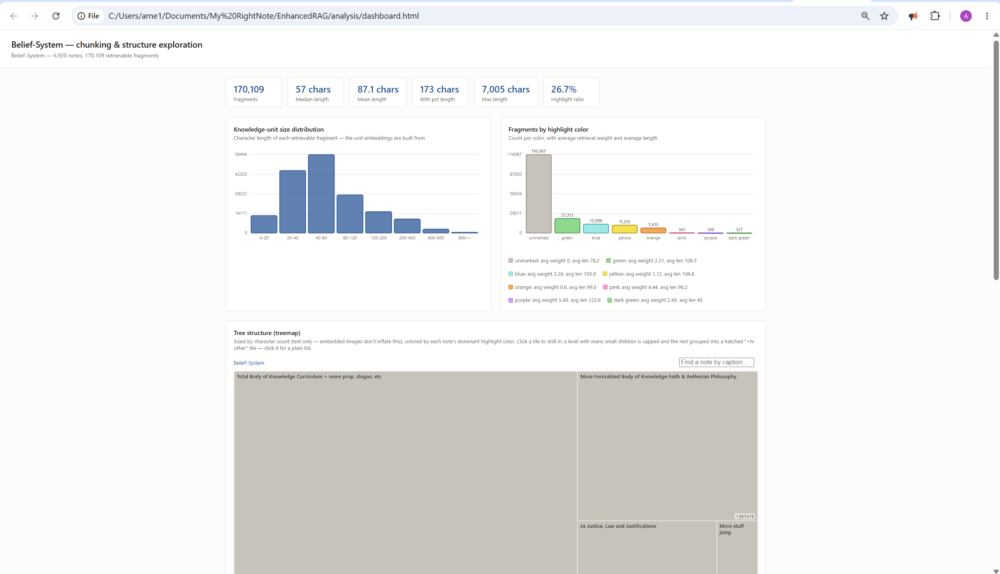 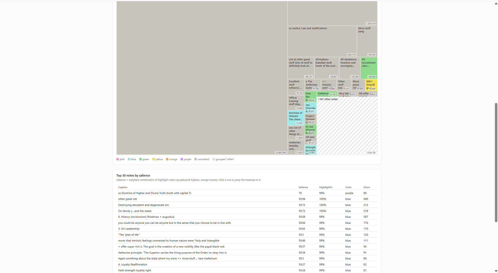

---

## Structure

```
EnhancedRAG/
├── README.md
├── pyproject.toml            package metadata (uv / pip installable)
├── requirements.txt          plain pip alternative
├── .env.example              copy to .env; every setting is optional
├── Dockerfile
├── docker-compose.yml
│
├── docs/                      INSTALL.md, USER_GUIDE.md, ARCHITECTURE.md, REPLICATION.md
├── data/                     your .rnt archive + the built corpus.db  (git-ignored)
├── exports/                  output of the export tool                (git-ignored)
├── results/                  eval.db, figures/, analysis_payload.json (git-ignored)
├── analysis/                 exploratory data viz + thesis figure generator
├── tools/                    standalone utilities (clipboard tool)
│
├── scripts/                  thin CLI entry points, no logic
│   ├── doctor.py                diagnose what's broken — run this first
│   ├── build_corpus.py         .rnt  ->  data/corpus.db
│   ├── build_index.py          keyword index + both embedding variants
│   │                            (--sample N for a fast test pass)
│   ├── serve.py                the web server
│   ├── run_eval.py             the experiment
│   ├── analyse.py              statistics for the thesis
│   ├── export_tool.py          selective clipboard export
│   ├── make_subset_archive.py  redacted, page-scoped copy of the .rnt for sharing
│   └── mcp_server.py           MCP server for Claude Desktop
│
└── src/enhanced_rag/
    ├── settings.py           paths, model presets, the regime matrix,
    │                          SCOPE_PAGE_IDS (which pages are in scope)
    ├── mcp_server.py         MCP tools (read-only)
    │
    ├── core/                 domain — no I/O beyond the archive format
    │   ├── colours.py          THE colour/weight system, single source of truth
    │   ├── rtf_parser.py       RTF -> spans with colour and bold
    │   └── rnt_crud.py         the only sanctioned writer to the .rnt
    │
    ├── repositories/         data access, all SQL lives here
    │   ├── corpus_repository.py    knowledge units + vectors, scope-filtered
    │   └── results_repository.py   runs + ratings
    │
    ├── services/             logic, no Flask, no SQL
    │   ├── models.py           embedder + generator clients, swappable
    │   ├── indexer.py          builds FTS and embeddings
    │   ├── retrieval.py        the regime-driven retriever
    │   ├── rag_service.py      orchestration — the thing everything calls
    │   └── export_service.py   tiered bulk export, curation, branch summarization
    │
    ├── evaluation/
    │   ├── questions.py        the question set, grouped with hypotheses
    │   ├── runner.py           runs regimes x questions
    │   └── statistics.py       paired tests, per-group tables
    │
    ├── exporting/
    │   ├── cli.py              selective export, GUI + headless
    │   └── export_top_units.py existing bulk exporter
    │
    ├── pipeline/             one-off build stages
    │   ├── build_shadow_db.py
    │   └── build_knowledge_units.py
    │
    └── web/
        ├── app.py            app factory, mounts both blueprints
        ├── explorer.py       /        archive explorer (browse + edit .rnt)
        ├── rag.py            /rag     bench + rating
        └── static/
            ├── explorer.html        the editor
            ├── explorer_debug.html  same + toggleable parser section overlay (/debug)
            ├── bench.html           retrieval bench, light theme matching the explorer
            ├── export.html          bulk export — colours, tree/branch filter, curate-for-question
            └── rate.html
```

**Why the layering.** Repositories own SQL, services own logic, the web
layer owns HTTP. So the retriever can be tested without a server, the
bench can run without the archive present, and swapping SQLite later
touches one directory. `scripts/` holds no logic — every script is a
dozen lines of argument parsing over a service call.

**The explorer and the bench are already one server.** They are separate
blueprints on separate URL prefixes, so moving the chat into the
explorer's right-hand pane later is a frontend change only.

---

## Install

Pick one. All three give the same result.

**uv (fastest)**
```bash
uv sync
uv run python scripts/serve.py
```

**pip**
```bash
python -m venv .venv && .venv\Scripts\activate    # or: source .venv/bin/activate
pip install -r requirements.txt
python scripts/serve.py
```

**Docker**
```bash
docker compose up --build
```
Ollama stays on the host in the Docker setup — it keeps your pulled models
and any GPU access, and the container reaches it via
`host.docker.internal`. On Linux the `extra_hosts` line in
`docker-compose.yml` makes that resolve.

Then, whichever route you took:
```bash
ollama serve                     # its own terminal
ollama pull nomic-embed-text     # embeddings
ollama pull qwen2.5:7b-instruct  # generation
cp .env.example .env             # optional; defaults work
```

---

## Getting to a working demo

```bash
# 0. put your archive here
#    data/PersonalArchive.rnt

python scripts/build_corpus.py     # .rnt -> data/corpus.db  (slow, once)
python scripts/build_index.py      # keyword index + embeddings  (slow, once)
python scripts/serve.py
```

- `http://localhost:5000/` — archive explorer
- `http://localhost:5000/debug` — the same explorer with a "Sections"
  toggle overlaying the parser's block/section breaks — for checking how
  a note actually gets chunked, without touching the real editor
- `http://localhost:5000/rag/` — the bench: ask a question, run any number
  of regimes side by side, pick the model from the header dropdown, adjust
  how much context it gets with live sliders (raw fragment count, or "fill
  N% of the context window"), toggle organic-prose vs cited answers, copy
  the formatted context to paste into an external chat UI
- `http://localhost:5000/rag/rate` — rate answers

Both halves fail independently. No archive at `data/` and the bench still
works; no corpus built and the explorer still works. `/health` says which.

---

## Swapping models

Named presets in `settings.py`. **Actually used and tested in this
project**: `local-qwen` (Ollama, dropped for insufficient answer quality —
see `docs/REPLICATION.md`), `lmstudio` and `lmstudio-2` (LM Studio, used
throughout the published evaluation). `local-llama`, `deepseek`,
`openai-compatible`, and `openrouter` are also defined as presets — the
plumbing for any OpenAI-compatible or Ollama endpoint is generic — but were
not exercised in this project's own evaluation; treat them as untested
starting points, not validated options.

```bash
python scripts/run_eval.py --generator lmstudio
python scripts/build_index.py --embedder minilm --force
```

or set `RAG_GENERATOR` / `RAG_EMBEDDER` in `.env`, or pick from the
dropdown in the bench header. Adding a preset is one dict entry.

Changing the *embedder* changes the vector dimensions, so the index must
be rebuilt with `--force`. The corpus repository checks this on load and
says so rather than returning silent nonsense.

Every generator carries an explicit `context_window`, which is actually
enforced: for Ollama backends it's passed as `num_ctx` on every request,
because Ollama otherwise silently defaults to ~2048-4096 tokens regardless
of prompt size — fragments beyond that would get dropped with no error.

**LM Studio**: point `RAG_LMSTUDIO_MODEL` at whatever's loaded (check LM
Studio's server tab for the exact identifier), and make sure the local
server is actually started — the app running isn't enough. Check for
duplicate/stale loaded instances first (`lms ps`) — a leftover instance at
the wrong context length can silently answer instead of the one just
reloaded, with no error, just truncated output:
```bash
"$env:USERPROFILE\.lmstudio\bin\lms.exe" ps
"$env:USERPROFILE\.lmstudio\bin\lms.exe" unload --all
"$env:USERPROFILE\.lmstudio\bin\lms.exe" server start
"$env:USERPROFILE\.lmstudio\bin\lms.exe" load gemma4-26b-a4b-uncensored-hauhaucs-balanced-q4_k_p -c 16384 -y
```
Per-model sampling params (`top_k`, `top_p`, `repeat_penalty`,
`presence_penalty`) go in that generator's `gen_params` dict in
`settings.py` — passed through as extra fields on the OpenAI-compatible
call, which LM Studio/llama.cpp accept as server extensions.

Two LM Studio slots (`lmstudio`, `lmstudio-2`) are defined so a second
local model can be evaluated without overwriting the first preset — LM
Studio can have both loaded at once and you just pick which slot's model
to hit from the bench's generator dropdown or `--generator`.

**OpenRouter**: set `RAG_OPENROUTER_API_KEY` and `RAG_OPENROUTER_MODEL` to
an exact slug from openrouter.ai/models.

---

## The regimes

Defined in `settings.REGIMES`. Each changes essentially one thing relative
to its parent, so a difference in results is attributable to that thing.

| Key | What it adds |
|---|---|
| `R0_baseline_fts` | Lexical BM25 over plain text. No embeddings, no metadata. |
| `R1_baseline_vector` | Dense retrieval, plain-text embeddings. The RAG control. |
| `R2_weight_boost` | R1 + colour weight in the ranking score |
| `R3_context_embed` | R1 but embedded with the breadcrumb path |
| `R4_weight_filter` | R2 restricted to highlighted fragments |
| `R5_prompt_meta` | R2 + colour tags and paths shown to the generator |
| `R6_full_metadata` | Everything on, plus note-level expansion |
| `R7_long_context` | No query-time retrieval — the long-context control |
| `R8_pooled_curated` | Keyword + vector hits pooled before expansion — the automated "curate for a question" workflow |

Adding a regime is one dict entry. The bench, the runner and the
statistics all read `settings.REGIMES` and need no other change.

---

## Running the experiment

```bash
python scripts/run_eval.py --questions     # see the question set
python scripts/run_eval.py --dry-run       # retrieval only, seconds
python scripts/run_eval.py                 # full run, resumable
python scripts/analyse.py
python scripts/analyse.py --csv results/table.csv
```

**Do the dry run first.** It prints a Jaccard overlap matrix of what each
regime retrieved. Two regimes overlapping above ~0.90 are the same
experiment twice — fix that before spending hours of generation and rating
on it.

### Rating

`/rag/rate` has two modes:

- **Blind** (default) — answers shuffled, regime labels hidden. Use these
  scores for any claim in the thesis.
- **Show regimes** — labels visible, stable order. For inspecting a
  specific regime's behaviour when you're not scoring for the record.

Which mode each rating was given under is stored, and `analyse.py` reports
the split. You only need the blind discipline for numbers that go in the
write-up; poking at R6's behaviour with the labels on is just working.

Rating is manual by design. An LLM judge cannot score answers about an
archive only you know well, so there isn't one.

### Why the per-group breakdown is the finding

`evaluation/questions.py` groups questions by retrieval challenge, not by
topic, and each group carries a written hypothesis. The literature
predicts metadata gains are *uneven* across question type, so a single
averaged number would hide the result worth reporting.

---

## Export tool (single-note, clipboard)

```bash
python scripts/export_tool.py                  # popup
python scripts/export_tool.py --in note.rtf --colors u,p,b --format line --legend
python scripts/export_tool.py --in note.rtf --out selected.txt   # -> exports/
```

Copy a selection in RightNote, then pick which colours to keep, bold-only
or not, and the format: one line per fragment (compact, for bulk), inline
tags like `[BLU]...[/BLU]` (preserves position, for editing), or plain.
"Explain the colours" prepends the same legend the RAG system gives the
model, from `core/colours.py` — so the export, the prompt and the thesis
all describe the colour system in identical words.

The GUI's clipboard read is Windows-only; `--in`/`--out` works anywhere.

---

## Bulk Export (web tool, whole-archive)

`http://localhost:5000/rag/export` — for pulling a large, thematically
coherent slice of the archive (not one note) into a big-context model's
chat window. Ported from an older standalone script, now backed by
`services/export_service.py`.

**Tiered budget.** Colours fill a character budget in priority order —
purple+pink always in first, then blue, green, yellow, orange, then two
extra virtual tiers: bold-but-uncoloured text, then any uncoloured text —
so a tight budget always keeps the highest-signal material and a branch
the author never got round to highlighting still exports *something*
instead of nothing (the "adaptive fallback": if a selected branch has zero
hits under the checked colours, it automatically falls back to
bold/uncoloured text from that same branch).

**Scope filters, three ways to combine:**
- **Colours** — checkboxes, live unit/char counts per colour.
- **Tree branches** — the same lazy-loaded accordion the explorer uses,
  with a checkbox per node (checking a branch includes every note under
  it) and a small colour swatch per node so you can spot a branch by the
  colour you remember tagging it. A 👁 preview icon shows a branch's
  actual content before you commit to checking it in.
- **Curate for a question** — type a topic (e.g. "What is Aetherialism?")
  and it pools two retrieval regimes (keyword + vector) to find which
  *notes* are relevant, then exports each matched note's full tiered
  content — not just the single matched line, so the model gets the
  surrounding context around every hit.

**Output shape.** Outline-style, deduplicated: a shared tree-path prefix
between sibling notes is printed once and indented, not repeated per note.
Optional checkboxes prepend a framing intro ("this is an export of a
personal archive...") and/or the colour-tag legend, in the same wording
used by the clipboard tool — for pasting into a chat that has no other
context on the archive.

**"Sort by recency"** flips the outline order to flat, newest-first
(`knowledge_units.date_created` — note creation date, not last-edited;
the pipeline doesn't currently carry a last-modified timestamp through to
the corpus).

**Summarize selection** sends the tiered content to a generator (default:
the local uncensored LM Studio model) and asks for a short "essence"
summary — themes, recurring style, standout quotes — primed with the
archive's own stated purpose (`export_service.CORE_INTENT_CONTEXT`) so the
summary orients around what the material is actually for, not a generic
outline. This is the same role RAPTOR's leaf-summaries play, built once
per requested branch instead of recursively over the whole tree.

**MCP tools** (`mcp_server.py`, for Claude Desktop or any MCP client):
`branch_summary` and `bulk_export` expose this same tiering/curation logic
so a connected model can query the archive's structure and pull exactly
what it needs itself, instead of everything being pasted in up front.

---

## Clipboard tool (tray app)

```bash
pip install pywin32 keyboard pystray Pillow
python tools/clipboard_tool.py
```

Runs in the system tray. Copy formatted text from RightNote, then:
- `Ctrl+Shift+V` — convert the clipboard using the current settings
- `Ctrl+Shift+M` — open a small menu: which colours to include, whether to
  keep unmarked text, and an editable preamble (explains the tag system to
  whichever model you paste into — qualitative framing by default: colour
  signals a judgement call, not a hard rule, and sometimes marks contrast
  rather than quality)
- `Ctrl+Shift+Q` — quit

Output is plain text tagged `[BLU]...[/BLU]` etc. (same tags as
`core/colours.py`), ready to paste into ChatGPT/Claude/Gemini's web UI.
Settings persist to `tools/clipboard_tool_config.json`.

---

## Exploratory data viz

```bash
python analysis/export_for_viz.py     # corpus.db -> analysis/viz_data_page28.json
python analysis/build_dashboard.py    # -> analysis/dashboard.html (self-contained)
python -m http.server                 # from analysis/, then open the page
```

Chunk-size distribution, fragments-by-colour breakdown, and an interactive
drill-down treemap of the note tree — sized by parsed character count
(not raw RTF bytes, so embedded images don't distort tile sizes), capped
at ~28 tiles per level with the rest grouped into a clickable "+N other"
bucket so a level with 100+ children stays readable.

---

## Pitfalls

| Symptom | Cause and fix |
|---|---|
| `Cannot reach Ollama` | `ollama serve` not running, or a different port — set `OLLAMA_URL`. In Docker it must be `host.docker.internal`. |
| `vectors have the wrong size` | The embedder changed since indexing. `python scripts/build_index.py --force`. |
| `The keyword index is missing` | `python scripts/build_index.py` (`--fts-only` if you just want the baseline). |
| `Archive not found` | Put the `.rnt` at `data/PersonalArchive.rnt` or set `RAG_ARCHIVE`. The bench works without it. |
| Corpus build takes forever | Expected on the full archive. It is a one-off; the corpus is cached in `data/`. |
| `'deepseek' needs an API key` | Add `DEEPSEEK_API_KEY` to `.env` and restart. |
| Archive corrupted after editing | Never INSERT or DELETE on the `.rnt`'s FTS3 virtual tables — it destroys the search segments. `core/rnt_crud.py` is the only sanctioned writer, and the FTS5 index this project builds lives in the separate `corpus.db`. |
| Explorer search doesn't find something you just created/edited | Fixed — `rnt_crud.py`'s FTS writes used to update content but not the actual index. Should self-heal now (every write calls `rebuild_fts()`); if it ever regresses, `POST /api/fts/rebuild`. |
| "I edited this file and nothing changed" in the web UI | Check for a duplicate Flask route on the same path shadowing yours — happened once with a dead leftover route from before the blueprint consolidation. `app.url_map.iter_rules()` to list all registered routes. |
| `Cannot reach http://localhost:1234/v1` (LM Studio) | The LM Studio app running isn't enough — its local server is a separate toggle. `lms server start`, then `lms load gemma4-26b-a4b-uncensored-hauhaucs-balanced-q4_k_p -c 16384 -y`. |
| LM Studio answers connect but cut off mid-generation, only on longer prompts | Check `lms ps` for a duplicate/stale loaded instance at a smaller context — the base model identifier routes to whichever instance loaded it first, not necessarily the one just reloaded at the right context. `lms unload --all` then reload once. |

Set `RAG_ARCHIVE_READONLY=1` before a demo if you'd rather not risk writes
to the live archive.
